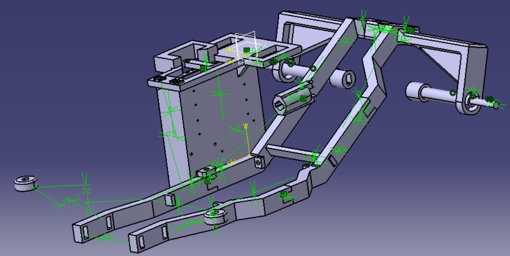
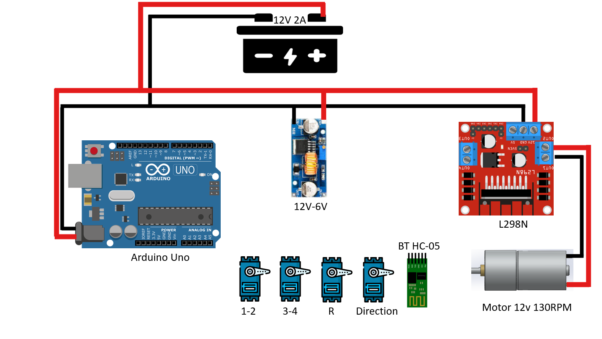
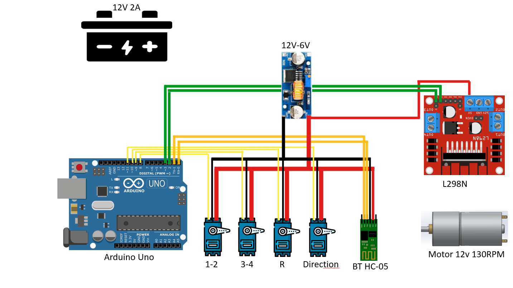
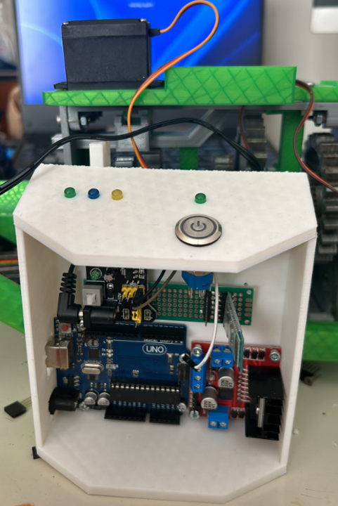

# Remote Controlled Car build with Arduino Uno/Nano and communication via Bluetooth and an automatic gearbox

This car was made by my friend Mattias and me for our college project
The Car has a gearbox with 4 gears that is controlled by 3 servos(1 for 1-2, another for 3-4 and one for reverse)

The gearbox as well as the frame were 3D printed
(gearbox site)

### Hardware components used for Remote Controlled Car

- Arduino Uno
- Battery [ 12V, +2000 mAh ] to power-up motors
- Bluetooth HC-05 slave module
- L298N Driver to control motors
- 1 12V 130RPM motor to power the rear wheels trough the gearbox
- Button to turn on/off the car
- Car structure, built by Mattias in Catia

### Software structure

The software was entirely made with c++

### Electrical schematics

### Final car build

